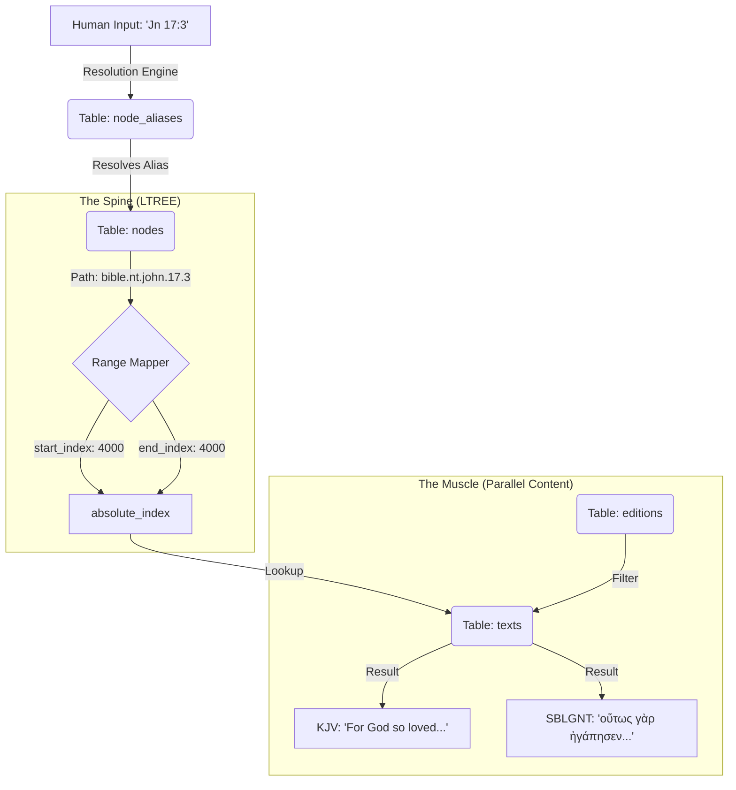

# Architecture: Data Flow & Schema Logic

This document provides a visual and logical map of the Scripture OS database. It illustrates how hierarchical requests are resolved into linear text segments using the **Stand-off Markup** model.

### **Architectural Design Decision: The Multi-Layer Discovery Flow**
Scripture OS does not store scripture as a flat file. It uses a **Three-Layer Discovery Flow** to ensure that human-readable input can be accurately mapped to aligned, multi-lingual content:
1.  **The Interface Layer (Aliases)**: Maps "Jn 17:3" to `bible.nt.john.17.3`.
2.  **The Structural Layer (Nodes)**: Maps the path to a numeric sequence range (`start_index` to `end_index`).
3.  **The Content Layer (Texts)**: Maps the sequence range to parallel linguistic strings (KJV, NIV, etc.).

---

## 1. Visual Schema Flowchart

---

## 2. Component Breakdown

### **A. Alias Resolution (The Router)**
* **Table**: `node_aliases`.
* **Role**: Acts as the entry point for human interaction.
* **Design Decision**: By decoupling aliases from paths, we allow for infinite linguistic variations (e.g., "1 John", "I Jn", "First John") without restructuring the database.

### **B. Node Hierarchy (The Spine)**
* **Table**: `nodes`.
* **Role**: Manages the canonical address space using `ltree`.
* **Technical Context**: The `nodes` table defines the **bounds** of a request. Whether you request a verse, a chapter, or an entire book, the logic remains identical: the system fetches the `start_index` and `end_index` for that coordinate.

### **C. Parallel Content (The Muscle)**
* **Tables**: `editions`, `texts`.
* **Role**: Stores the linguistic variants.
* **Design Decision**: Because different translations share the same `absolute_index`, the system achieves **Perfect Parallelism** by default. Ordering the query by `is_source DESC` ensures that original language manuscripts are prioritized in comparison views.

---

## 3. Data Integrity & Constraints

### **Architectural Design Decision: Sequence Locking**
* **Constraint**: `UNIQUE(edition_id, absolute_index)`.
* **Why**: This prevents a single translation from having "overlapping" verses. It ensures that for any given `absolute_index`, there is exactly zero or one text segment per edition.

### **Technical Context: GIST vs B-Tree**
* The system uses a **GIST Index** on `path` for tree traversal (e.g., "Give me all chapters in John").
* The system uses a **B-Tree Index** on `absolute_index` for content retrieval (e.g., "Give me all text between index 4000 and 4010").

---

**AI Prompt Hint:** When visualizing the database for a user, always emphasize that `nodes` are **Metadata** and `texts` are **Data**. The `absolute_index` is the unique key that links the two.
